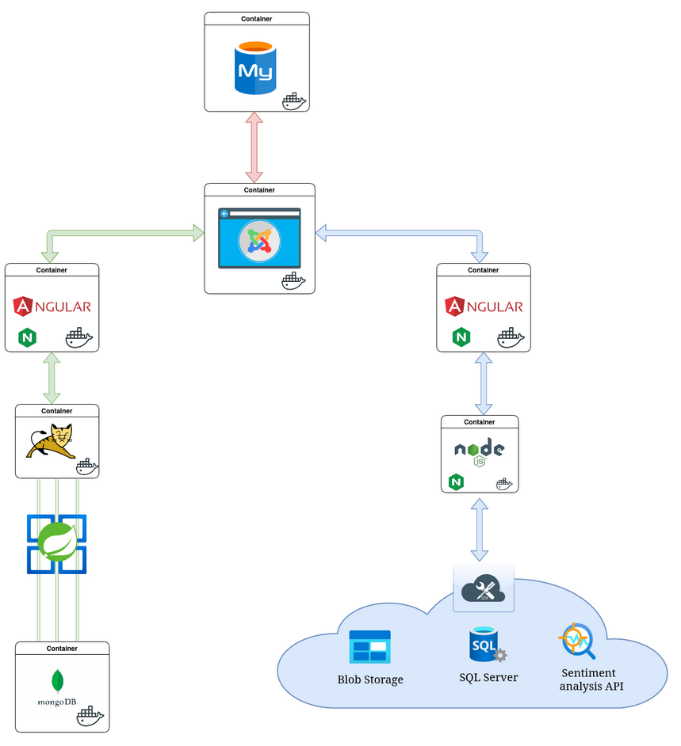

## Performance and Scalability Features

The architecture is designed with scalability and performance in mind:

### Horizontal Scaling

- Kubernetes Horizontal Pod Autoscaler (HPA) automatically scales pods based on CPU/memory metrics
- Joomla CMS scaled to 4 replicas for load distribution and high availability
- Chat backend scaled to 2 replicas for WebSocket connection distribution
- Frontend applications can be scaled as needed due to their stateless nature

### Performance Optimizations

- Content Delivery Network (CDN) integration for static assets
- Database query optimization with proper indexing
- Connection pooling for database connections
- Caching strategies at multiple levels:
  - Browser caching with appropriate headers
  - Application-level caching for frequently accessed data
  - Redis cache (optional) for distributed caching

### Resilience and Fault Tolerance

- Self-healing capabilities through Kubernetes health checks
- Circuit breakers for external service calls
- Graceful degradation when dependent services are unavailable
- Database replication for fault tolerance

## Development and Operations

### CI/CD Pipeline

- GitHub Actions for continuous integration
- ArgoCD for GitOps-based deployments
- Automated testing:
  - Unit tests for business logic
  - Integration tests for service interactions
  - End-to-end tests for user workflows

### Monitoring and Observability

- Prometheus for metrics collection
- Grafana for visualization and dashboards
- Loki for log aggregation
- Jaeger for distributed tracing
- Custom Kubernetes dashboards for cluster health

### Disaster Recovery

- Regular database backups
- Infrastructure as Code (IaC) with Terraform
- Documented recovery procedures
- Periodic recovery testing

## Conclusion

This Kubernetes-based web platform combines modern web technologies with cloud-native architecture to deliver a scalable, resilient system. By leveraging containerization and orchestration, the application can easily scale to meet demand while maintaining a clear separation of concerns between components. The integration of AI capabilities provides valuable sentiment analysis functionality, enhancing the overall user experience.# Kubernetes-based Web Platform with Chat and AI Integration

## Project Overview

This project implements a comprehensive web platform that integrates a content management system, real-time chat functionality, and AI-powered sentiment analysis capabilities, all orchestrated through Kubernetes. Designed for scalability and resilience, this microservices architecture provides a modern user experience while leveraging cloud-native technologies.

## Architecture Diagram

_The architecture diagram illustrates our system's container-based design with MySQL, Joomla, Angular, Tomcat, and Node.js components, all connected to Azure cloud services (Blob Storage, SQL Server, and Sentiment Analysis API)._

### Diagram Explanation

The diagram showcases our microservices architecture with clearly defined communication paths:

- **Top Layer**: MySQL database container supporting the Joomla CMS
- **Middle Layer**: Joomla CMS container (center) connecting to both Angular frontends
- **Left Branch**: Chat system with Angular frontend, Tomcat backend, and MongoDB for message storage
- **Right Branch**: AI application with Angular frontend, Node.js backend connecting to Azure services
- **Cloud Services**: Azure Blob Storage for files, SQL Server for metadata, and Sentiment Analysis API

Each container is independently scalable and managed by Kubernetes, with appropriate networking between components.

## Components and Workflow

### 1. Content Management System (CMS)

- **Technology**: Joomla 4.x with PHP 8.1
- **Replicas**: 4 for high availability and load balancing
- **Port**: 80 (HTTP) with option for TLS termination
- **Purpose**: Serves as the central hub for user interaction, hosting the main website content and embedding other services
- **Database**: MySQL 8.0 for CMS content storage, user accounts, and system configuration
- **Workflow**: Content creators manage site through Joomla's admin interface, while visitors browse customized pages with embedded chat and AI functionality

### 2. Chat System

- **Backend**:
  - **Technology**: Java 17 with Tomcat 10, implementing JSR 356 WebSocket API
  - **Replicas**: 2 for fault tolerance and distribution of WebSocket connections
  - **Port**: 88 for WebSocket traffic
  - **Protocol**: WebSocket for real-time bidirectional communication
  - **Storage**: MongoDB for message persistence with sharding capabilities
- **Frontend**:
  - **Technology**: Angular 16+ with RxJS for reactive programming
  - **Replicas**: 1 (stateless, can be scaled as needed)
  - **Port**: 90
  - **UI**: Modern, responsive design with real-time message updates
- **Features**:
  - Real-time messaging with typing indicators
  - Message persistence with MongoDB for historical context
  - Chronological message display with infinite scrolling
  - User identification and session management
  - Message timestamp and delivery status
- **Integration**: Embedded in CMS via iframe with seamless styling
- **Workflow**: Users enter username, type messages in the chat input field, and send with a button click or Enter key. Messages instantly appear for all connected users and are stored in MongoDB for persistence.

### 3. AI Application

- **Frontend**:
  - **Technology**: Angular 16+ with NgRx for state management
  - **Replicas**: 1 (stateless, can be scaled)
  - **UI**: Drag-and-drop file upload interface with progress indicators
- **Backend**:
  - **Technology**: Node.js with Express.js for API endpoints
  - **Cloud Integration**: Azure SDK for JavaScript
- **Features**:
  - File upload capability with validation and progress tracking
  - Processing history with sorting and filtering options
  - Detailed sentiment analysis results with visual representation
  - Integration with Azure AI services via REST APIs
- **Storage**:
  - File storage: Azure Blob Storage with redundancy options
  - Metadata storage: Azure SQL Database (serverless tier)
- **AI Service**: Azure Text Analytics API for sentiment analysis (scoring 0-1, with categorization)
- **Integration**: Embedded in CMS via responsive iframe
- **Workflow**: Users upload text files through the interface, files are stored in Azure Blob Storage, the Node.js backend sends the text to Azure's Sentiment Analysis API, results are stored in SQL Database and displayed to the user with sentiment scores and visualizations.

## Deployment Instructions

1. Set up Kubernetes cluster
2. Apply the XML configuration
3. Deploy database services
4. Deploy CMS with required configurations
5. Deploy chat backend and frontend services
6. Deploy AI application
7. Configure networking and expose appropriate services

## Technologies Used in Detail

### Infrastructure and Orchestration

- **Kubernetes**: Orchestrates containerized applications, managing deployment, scaling, and operations
  - Uses namespaces for logical separation of components
  - Implements resource quotas and limits
  - Leverages StatefulSets for stateful applications like databases
- **Docker**: Containerization platform for application packaging
  - Multi-stage builds for optimized container images
  - Custom base images with security hardening

### Frontend Technologies

- **Angular 16+**: Modern frontend framework for both chat and AI applications
  - TypeScript for type-safe code
  - RxJS for reactive programming and WebSocket integration
  - Angular Material for UI components
  - NgRx for state management in the AI application
- **HTML5/CSS3/JavaScript**: Core web technologies
  - CSS Grid and Flexbox for responsive layouts
  - WebSockets API for real-time communication

### Backend Technologies

- **Joomla 4.x**: PHP-based content management system
  - Customized templates and modules
  - RESTful API for headless CMS functionality
- **Java 17**: For chat backend implementation
  - JSR 356 WebSocket implementation
  - Spring Boot for dependency injection and configuration
  - JPA for data persistence layer
- **Tomcat 10**: Java web server and servlet container
  - Customized for WebSocket performance
  - Clustered for high availability
- **Node.js 18+**: For AI application backend
  - Express.js for RESTful API endpoints
  - Azure SDK for JavaScript
  - Multer for file upload handling

### Database and Storage

- **MySQL 8.0**: Relational database for Joomla CMS
  - InnoDB storage engine for ACID compliance
  - Connection pooling for performance
- **MongoDB 6.0**: NoSQL database for chat messages
  - Document-based storage for flexible message formats
  - Sharding for horizontal scaling
- **Azure Blob Storage**: Object storage for uploaded files
  - Hot access tier for frequently accessed files
  - Lifecycle management for cost optimization
- **Azure SQL Database**: Managed SQL service for AI application metadata
  - Serverless tier for cost efficiency
  - Point-in-time restore capabilities

### AI and Integration

- **Azure Text Analytics**: API for sentiment analysis
  - Scores text from 0 (negative) to 1 (positive)
  - Provides detailed sentiment breakdown
  - Language detection capabilities
- **Azure SDK**: Integration libraries for cloud services
  - Identity and access management
  - Resource monitoring and management
